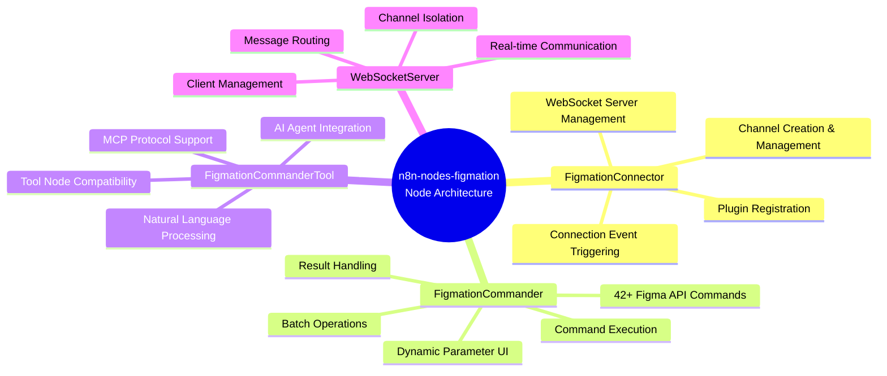

# n8n-nodes-figmation

n8n custom nodes package for Figma workflow automation. Connects to Figma plugin via WebSocket server to execute 55+ Figma API commands including batch style operations, multiple node selection, and component instance management.

## 🎯 Core Architecture


## 🔄 Data Flow


## ⚡ Key Features

- **55+ Figma API Commands Support**: create_rectangle, create_text, move_node, instance management, and more
- **WebSocket Server**: Real-time communication with Figma plugin
- **Channel-based Isolation**: Multi-channel support for workflow separation
- **MCP Integration**: Tool nodes for AI agent compatibility
- **Dynamic UI**: Auto-generate parameter fields based on selected command
- **Batch Style Operations**: Apply styles to multiple nodes at once
- **Multiple Node Selection**: Select nodes by IDs, type, or name pattern
- **Component Instance Management**: Get/set instance overrides, detach instances from components
- **Font Search**: Search available fonts with keyword filtering
- **Localhost-only Connections**: Simplified configuration for enhanced security and stability
- **Fixed Host Configuration**: WebSocket host fixed to localhost for reliable local development

## 🏗️ Component Architecture


## 🎯 Node Architecture



## 📋 Changelog

### v1.2.2 (Latest)
- ✨ **Component Instance Management**: Added get_instance_overrides, set_instance_overrides, detach_instance commands
- 🔍 **Font Search Enhancement**: Added keyword filtering to search_available_fonts
- 🎨 **UI Component Properties**: Enhanced get_components with variant property information
- 🔧 **Node ID Normalization**: Fixed hyphen to colon conversion for Figma node IDs
- 📝 **User-Friendly UI**: Improved set_instance_overrides with structured array inputs instead of JSON
- 🐛 **Dynamic Page Fix**: Replaced synchronous API calls with async versions
- 🗑️ **Cleanup**: Removed unused get_reactions placeholder command

### v1.2.1
- 🏠 **Localhost Only**: Simplified to localhost-only connections for better stability
- 🗑️ **Removed Complex Features**: Eliminated connection types, host configuration, and path settings
- 🔧 **Fixed Parameter Dependencies**: Resolved n8n displayOptions circular dependency issues
- ⚡ **Simplified WebSocket**: Direct port-based connections without paths
- 🛡️ **Enhanced Security**: Local-only connections prevent external access issues

### v1.2.0
- 🔗 **Connection Type Support**: Added standalone (port-based) and integrated (path-based) connection modes
- 🛣️ **Path-based WebSocket**: Support for WebSocket paths (e.g., `/ws`) for reverse proxy setups
- 🔧 **Enhanced Parameter Handling**: Fixed "Could not get parameter" errors with conditional UI fields
- 🌐 **Improved Domain Support**: Better handling of external domains and localhost path connections
- 📝 **Better Error Messages**: Enhanced logging and error reporting for connection issues

### v1.1.0
- ✨ **External Server Access**: Added support for cloud deployments and remote connections
- 🔧 **Flexible Host Configuration**: Configurable WebSocket host (localhost or 0.0.0.0)
- 🌐 **Cloud Deployment Support**: Enable n8n.cloud and custom domain connections
- 🔒 **Security Protocols**: Support for both ws:// and wss:// protocols
- 📚 **Enhanced Documentation**: Updated setup instructions for external access

### v1.0.0
- 🎉 **Initial Release**: 43+ Figma API commands support
- 🔌 **WebSocket Communication**: Real-time connection with Figma plugin
- 📡 **Channel-based Isolation**: Multi-channel support for workflow separation
- 🤖 **MCP Integration**: Tool nodes for AI agent compatibility
- 🎨 **Dynamic UI**: Auto-generate parameter fields based on selected command

## Installation and Usage

### Development Environment Setup

```bash
# Install dependencies
npm install

# TypeScript build and asset copy
npm run build

# Development mode (watch mode)
npm run dev

# Install to n8n instance
./install.sh
```

### Using in n8n

1. Restart n8n instance
2. "Figma Connector" and "Figma Commander" nodes available
3. Build Figma event-based automation workflows

### Configuration

The nodes are configured for **localhost-only connections** for enhanced security and stability:

- **Host**: Fixed to `localhost` (cannot be changed)
- **Port**: Configurable (default: 3055)
- **Connection URL**: `ws://localhost:{port}` (no path)

This simplified configuration eliminates external server access issues and ensures reliable local development.

## Node Types

### FigmationConnector (Trigger Node)

Starts WebSocket server and manages connection with Figma plugin.

**Key Features:**
- Start/stop WebSocket server on localhost
- Channel creation and management
- Plugin registration and status monitoring
- Connection event triggering
- Simplified localhost-only configuration

### FigmationCommander (Action Node)

Main action node that executes Figma API commands.

**Supported Commands (55+):**

#### Shape Creation Commands
- `create_rectangle`: Create rectangle with optional corner radius
- `create_ellipse`: Create ellipse with optional arc data
- `create_circle`: Create circle
- `create_line`: Create line
- `create_star`: Create star shape
- `create_polygon`: Create polygon
- `create_vector_path`: Create custom vector path from SVG data

#### Text Commands
- `create_text`: Create text node with font styling
- `update_text`: Update text content and properties
- `set_text_content`: Change text content (alias for update_text)
- `set_font`: Set font properties
- `scan_text_nodes`: Find all text nodes in document
- `set_multiple_text_contents`: Update multiple text nodes at once
- `search_available_fonts`: Search fonts with keyword filtering

#### Frame and Layout Commands
- `create_frame`: Create frame container
- `create_auto_layout`: Create auto-layout frame
- `create_instance`: Create instance from component
- `create_component`: Create component from existing node IDs
- `set_layout_grid`: Apply layout grid
- `set_layout_mode`: Configure auto-layout properties
- `set_padding`: Set padding for auto-layout
- `set_item_spacing`: Set spacing between items

#### UI Component Commands
- `create_button`: Create button component
- `create_input_field`: Create input field component
- `create_checkbox`: Create checkbox component
- `create_toggle`: Create toggle switch component

#### Style Commands
- `set_fill_color`: Set fill color
- `set_stroke_color`: Set stroke color and properties
- `set_opacity`: Set node opacity
- `set_corner_radius`: Set corner radius
- `set_individual_corner_radius`: Set individual corner radii
- `apply_effect`: Apply visual effects

#### Effect Commands
- `add_drop_shadow`: Add drop shadow effect
- `add_inner_shadow`: Add inner shadow effect
- `add_blur`: Add blur effect

#### Selection Commands
- `select_nodes`: Select multiple nodes by IDs
- `select_nodes_by_type`: Select all nodes of specific type
- `select_nodes_by_name`: Select nodes by name pattern

#### Batch Style Commands
- `apply_styles_to_selection`: Apply styles to selected nodes
- `apply_text_styles_to_selection`: Apply text styles to selected text nodes
- `apply_styles_to_nodes`: Apply styles to specific nodes by IDs

#### Manipulation Commands
- `move_node`: Move node to new position
- `resize_node`: Resize node dimensions
- `rotate_node`: Rotate node
- `set_rotation`: Set rotation angle
- `group_nodes`: Group multiple nodes
- `ungroup_node`: Ungroup nodes

#### Boolean Operations
- `boolean_union`: Union operation
- `boolean_subtract`: Subtract operation
- `boolean_intersect`: Intersect operation
- `boolean_exclude`: Exclude operation
- `create_boolean_operation`: Create boolean operation with type

#### Image Commands
- `create_image_from_url`: Create image from URL
- `replace_image`: Replace existing image
- `create_design_from_svg`: Create design from SVG

#### Instance Management Commands
- `get_instance_overrides`: Get override properties of a component instance
- `set_instance_overrides`: Apply overrides to a component instance
- `detach_instance`: Detach instance from its main component

#### Information Commands
- `get_document_info`: Get document information
- `get_selection`: Get selected elements information
- `get_node_info`: Get specific node information
- `get_nodes_info`: Get multiple nodes information
- `get_page_info`: Get current page information
- `get_components`: Get list of components with properties
- `search_nodes`: Search nodes by criteria

#### Management Commands
- `delete_node`: Delete single node
- `delete_multiple_nodes`: Delete multiple nodes
- `clone_node`: Clone node
- `export_node_as_image`: Export node as image

### FigmationCommanderTool (Tool Node)

Tool node for AI agent compatibility. Supports MCP (Model Context Protocol) integration.

## Workflow Examples

### Basic Connection Workflow

```json
{
  "nodes": [
    {
      "type": "CUSTOM.figmationConnector",
      "position": [100, 100],
      "parameters": {
        "port": 3055,
        "channelName": "my-project"
      }
    },
    {
      "type": "CUSTOM.figmationCommander",
      "position": [300, 100],
      "parameters": {
        "command": "create_rectangle",
        "params": {
          "x": 100,
          "y": 100,
          "width": 200,
          "height": 150,
          "name": "My Rectangle"
        }
      }
    }
  ]
}
```

### MCP Integration Workflow

Check `examples/mcp-workflow.json` file for complete MCP workflow with 55+ tool nodes supporting all Figma commands.

**Note**: The MCP workflow example includes advanced gradient fills, component instance management, and custom commands. New features like instance overrides and font search have been added for enhanced AI agent compatibility.

## Architecture

### WebSocket Communication Flow

```
n8n Workflow → FigmationCommander → WebSocketServer → Figma Plugin → Figma API
```

### Channel System

Each workflow provides isolated communication through unique channels:

1. **Channel Creation**: FigmationConnector creates a named channel
2. **Client Registration**: Figma plugin connects to a specific channel
3. **Command Routing**: FigmationCommander specifies channel ID for specific channel
4. **Isolation**: Each channel maintains separate client lists

## Development Guide

### Adding New Commands

1. Add command in `src/nodes/FigmationCommander/FigmationCommander.node.ts`:
```typescript
{
  name: 'New Command',
  value: 'new_command',
  description: 'Description for new command'
}
```

2. Define parameters: Add parameter fields to node's properties array

3. Add same command handler to Figma plugin (separate repository)

### Error Handling

- **Connection Failure**: Timeout and retry mechanisms
- **Command Timeout**: 10-second timeout and cleanup
- **Channel Error**: Channel existence and permission validation
- **Figma API Error**: Design mode validation and parameter checking

## Tech Stack

- **Runtime**: Node.js
- **Language**: TypeScript
- **WebSocket**: ws library
- **Build Tool**: TypeScript compiler
- **Packaging**: npm

## License

MIT License

## Developer Information

- **Name**: Dante
- **Company**: Dante Labs
- **Email**: datapod.k@gmail.com
- **Company Homepage**: https://dante-datalab.com
- **YouTube**: https://youtube.com/@dante-labs

## Related Projects

- [figma-plugin-figmation](https://github.com/dandacompany/figma-plugin-figmation): Figma plugin

## Acknowledgments

This project was inspired by [Cursor Talk to Figma MCP](https://github.com/sonnylazuardi/cursor-talk-to-figma-mcp) by [@sonnylazuardi](https://github.com/sonnylazuardi). We extend our gratitude for the innovative MCP integration approach that enabled us to create an n8n workflow-compatible version for Figma automation.

Special thanks to the original project for demonstrating the power of Model Context Protocol (MCP) in bridging AI tools with design workflows. 